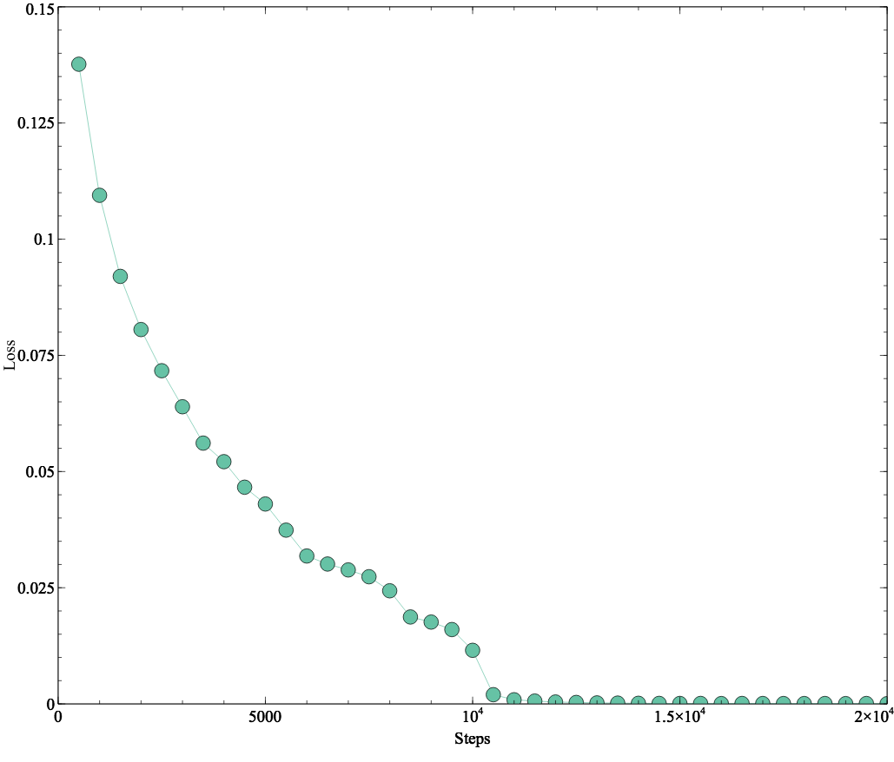

# Input Switched Affine Networks: An RNN Architecture Designed for Interpretability (ICML 2017)
 
> There exist many problem domains where the
interpretability of neural network models is essential
for deployment. Here we introduce a recurrent
architecture composed of input-switched
affine transformations – in other words an RNN
without any explicit nonlinearities, but with inputdependent
recurrent weights. This simple form
allows the RNN to be analyzed via straightforward
linear methods: we can exactly characterize
the linear contribution of each input to the model
predictions; we can use a change-of-basis to disentangle
input, output, and computational hidden
unit subspaces; we can fully reverse-engineer
the architecture’s solution to a simple task. Despite
this ease of interpretation, the input switched
affine network achieves reasonable performance
on a text modeling tasks, and allows greater computational
efficiency than networks with standard
nonlinearities. --Abstract
## Parenthesis Task
The implementation was trained on the Parenthesis task. Here is the result:

    
  
<i>Loss as a function of the number of steps</i>

## Resources
- The paper is available at http://proceedings.mlr.press/v70/foerster17a/foerster17a.pdf

## Contributing
Thanks to Justin Gilmer, one of the authors of the paper for providing some source code under the Apache license.
